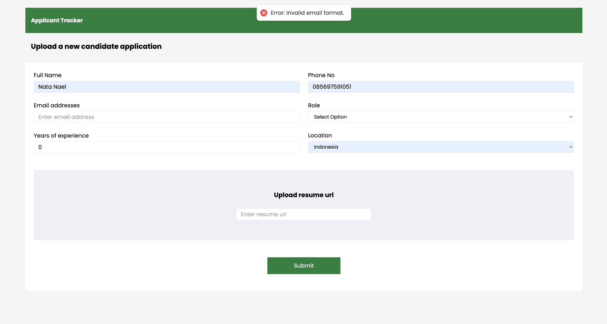

# Krom Take Home Test FE

### UI and Flow Example

#### Applications List


#### Creating new Application



### Setup

1. Build the docker image

```
docker build -t my-react-app .
```

2. Run docker nginx container for react app

```
docker run -d -p 80:80 my-react-app
```

3. React app will be served in `localhost:80`
